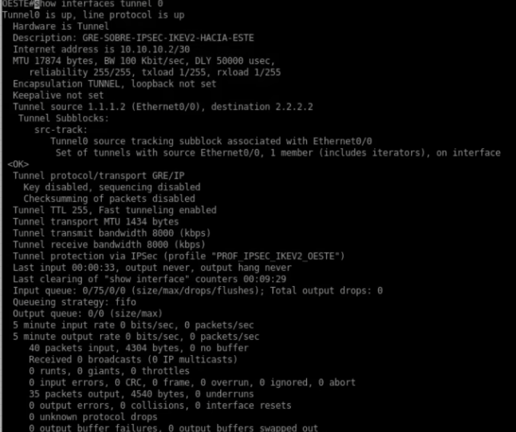
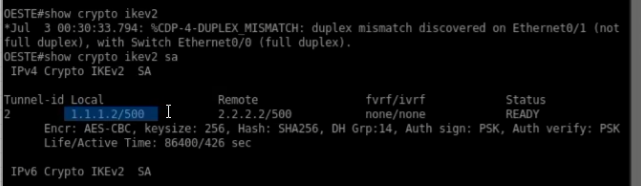
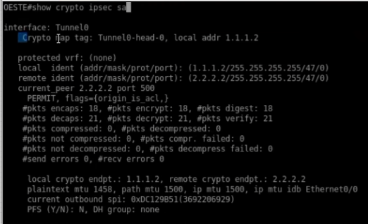
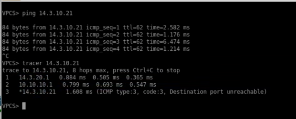

<h1>Instituto Tecnológico de Las Américas (ITLA)</h1>
  
<h2>Configuración y Verificación de VPN Site-to-Site con Túnel GRE sobre IPSec (IKEv2)</h2>

Documentación Técnica Profesional — Práctica 5 (Semana 6)

   

<strong>Estudiante:</strong> Alan Daniel Garcia Mendez 
<strong>Matrícula:</strong> 2025-1403 
<strong>Carrera:</strong> Seguridad Informática 
<strong>Asignatura:</strong> Seguridad de Redes 
<strong>Docente:</strong> Jonathan Esteban Rondon Corniel 
<strong>Fecha de Entrega:</strong> 2 de julio de 2026 
<strong>Video de Exposición:</strong> <a href="https://youtu.be/Y5GmpXJ-N88">https://youtu.be/Y5GmpXJ-N88</a> 
<strong>Repositorio de GitHub:</strong> <a href="https://github.com/imAlanG16/06_ipsec_ikev2_gre_s2s">https://github.com/imAlanG16/06_ipsec_ikev2_gre_s2s</a>

## Objetivo de la VPN
El objetivo de esta configuración es establecer un túnel multiprotocolo y de broadcast/multicast utilizando la encapsulación GRE (Generic Routing Encapsulation) cifrado mediante IPSec con el protocolo moderno de negociación IKEv2. Este modelo une las subredes de Oeste y Este a través de la infraestructura pública del ISP. La combinación de GRE e IKEv2 provee la flexibilidad de enrutamiento lógico directo en la interfaz `Tunnel0` junto con los beneficios criptográficos más recientes de la fase 2 de IPSec, empleando un diseño de protección directo (`tunnel protection`) que sustituye los complejos crypto maps tradicionales en las interfaces WAN físicas.

## Topología de Red y Direccionamiento
La topología física del laboratorio mantiene la interconectividad de sucursales a través del enrutador ISP intermedio. Lógicamente, las interfaces virtuales `Tunnel0` establecen una subred lógica dedicada `10.10.10.0/30`.

  
  
Topología física Site-to-Site utilizada en la práctica

El direccionamiento IP de las interfaces y subredes lógicas del escenario es:

| Dispositivo / Rol | Interfaz | Dirección IP / Subred | Detalles de Configuración |
| :--- | :--- | :--- | :--- |
| **Router OESTE (Peer 1)** | Ethernet0/0 | `1.1.1.2/30` | WAN física hacia ISP |
| | Ethernet0/1 | `14.3.20.1/24` | LAN interna corporativa (Rango 20.X) |
| | Tunnel0 | `10.10.10.2/30` | Source: `Ethernet0/0` / Dest: `2.2.2.2` |
| **Router ESTE (Peer 2)** | Ethernet0/0 | `2.2.2.2/24` | WAN física (Subred pública de tránsito) |
| | Ethernet0/1 | `14.3.10.1/24` | LAN interna corporativa (Rango 10.X) |
| | Tunnel0 | `10.10.10.1/30` | Source: `Ethernet0/0` / Dest: `1.1.1.2` |

## Parámetros Criptográficos Utilizados
Los parámetros criptográficos y de red configurados en el laboratorio para el túnel GRE IKEv2 son:

| Fase | Parámetro | Valor Configurado |
| :--- | :--- | :--- |
| **Fase 1 (IKEv2)** | Propuesta Criptográfica | IKEv2 Proposal (`PROP_IKEV2_OESTE` / `ESTE`) |
| **Fase 1** | Algoritmo de Cifrado | AES-CBC-256 |
| **Fase 1** | Función de Integridad | SHA-256 |
| **Fase 1** | Intercambio de Claves | Group 14 (Diffie-Hellman 2048-bit) |
| **Fase 1** | Llavero / PSK | `KEYRING_IKEV2` / `CISCO123` |
| **Fase 1** | Perfil IKEv2 | `PROFILE_IKEV2` |
| **Fase 2 (IPSec)** | Transform-Set | `TS_IKEV2` (`esp-aes 256 esp-sha256-hmac`) |
| **Fase 2** | Modo de Operación | Transport Mode (`mode transport`) |
| **Fase 2** | Asociación | Perfil IPSec (`PROF_IPSEC_IKEV2`) vinculado al Túnel |

## Explicación de la Configuración y Scripts
El enrutador OESTE y el enrutador ESTE configuran interfaces lógicas `Tunnel0` con modo de encapsulación `tunnel mode gre ip`. En lugar de aplicar un crypto map físico, la seguridad se encapsula en un perfil de IPSec (`crypto ipsec profile PROF_IPSEC_IKEV2`), el cual hace referencia al transform-set configurado en modo transporte (`mode transport`) y al perfil de IKEv2. Finalmente, la protección del túnel se asocia directamente en la configuración de la interfaz lógica mediante `tunnel protection ipsec profile PROF_IPSEC_IKEV2`. Las rutas para alcanzar las LAN opuestas se establecen apuntando a la IP del túnel remoto correspondiente.

Los comandos aplicados completos de este diseño se encuentran en: [script_configuracion.txt](resources/script_configuracion.txt).

## Verificación de Funcionamiento

### 1. Estado y Operatividad del Túnel GRE (Tunnel0)
Para confirmar la creación de la interfaz lógica de encapsulación GRE y su protección, se ejecuta el comando `show interfaces tunnel 0` en el router `OESTE`. La salida demuestra que el túnel se encuentra activo y su protocolo de línea en funcionamiento (**`up / up`**). 

Se detalla la dirección IP virtual asignada **`10.10.10.2/30`**, la definición de origen y destino público (`1.1.1.2` ➔ `2.2.2.2`), y la protección segura: **`Tunnel protection via IPSec (profile "PROF_IPSEC_IKEV2_OESTE")`**.

  
  
Detalles operativos de la interfaz virtual Tunnel0 en OESTE bajo IKEv2

### 2. Estado de la Negociación IKEv2 SA (Fase 1)
La comprobación de la negociación de Fase 1 bajo IKEv2 se verifica mediante el comando `show crypto ikev2 sa` en el router `OESTE`. La salida de consola ratifica que se ha establecido con éxito un túnel criptográfico seguro hacia el peer remoto `2.2.2.2` utilizando la IP local `1.1.1.2`. 

La SA está en el estado estable **`READY`**, y detalla los algoritmos utilizados: **`Encr: AES-CBC, keysize: 256, Hash: SHA256, DH Grp:14, Auth sign/verify: PSK`**. Esto demuestra una negociación robusta y moderna.

  
  
Estado IKEv2 SA en el router OESTE confirmando la autenticación e intercambio correctos

### 3. Asociación de Seguridad IPSec en el Túnel GRE (Fase 2)
Al ejecutar el comando `show crypto ipsec sa` en el router `OESTE`, se comprueba el estado criptográfico de la interfaz Tunnel0. A pesar de utilizar el comando `tunnel protection` directo en IKEv2, el enrutador genera dinámicamente un crypto map interno (`Tunnel0-head-0`) y matchea con precisión el tráfico del protocolo **GRE (Capa 47)** de WAN a WAN:
* `local ident: (1.1.1.2/255.255.255.255/47/0)`
* `remote ident: (2.2.2.2/255.255.255.255/47/0)`

Los contadores de tráfico confirman la protección de datos:
* **`#pkts encaps: 18`** y **`#pkts encrypt: 18`**
* **`#pkts decaps: 21`** y **`#pkts decrypt: 21`**

Esto comprueba que 18 paquetes GRE salientes fueron cifrados y 21 paquetes entrantes descifrados de forma correcta.

  
  
Estadísticas de la SA IPSec de Tunnel0 mostrando el filtrado exclusivo del protocolo 47 (GRE)

### 4. Prueba de Conectividad y Enrutamiento LAN a LAN (Traceroute GRE)
La verificación de conectividad extremo a extremo se realiza desde la consola del cliente VPCS corporativo en el extremo Oeste (LAN `14.3.20.0/24`). Al enviar pings hacia el host remoto en la LAN Este (`14.3.10.21`), los paquetes se completan de forma exitosa con **0% de pérdida**.

Adicionalmente, al trazar la ruta mediante el comando `tracer 14.3.10.21`, se comprueba el siguiente comportamiento:
1. El primer salto se dirige al gateway local de la LAN `14.3.20.1` (interfaz del router Oeste).
2. El segundo salto transita directamente a través del extremo virtual del túnel GRE remoto **`10.10.10.1`** (interfaz Tunnel0 del router Este). Esto demuestra de forma irrefutable que el tráfico LAN es encapsulado en GRE e inyectado al túnel cifrado.
3. El tercer salto alcanza al host de destino `14.3.10.21` a través del direccionamiento de la LAN remota.

  
  
Prueba de conectividad desde VPCS validando el enrutamiento lógico por el túnel GRE 10.10.10.1

